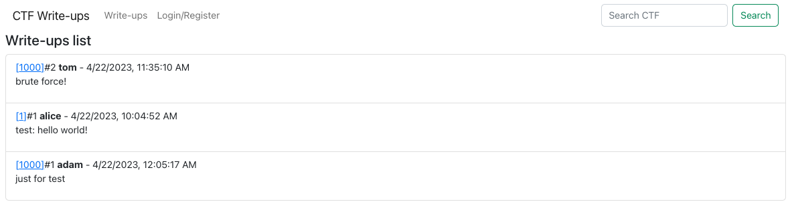
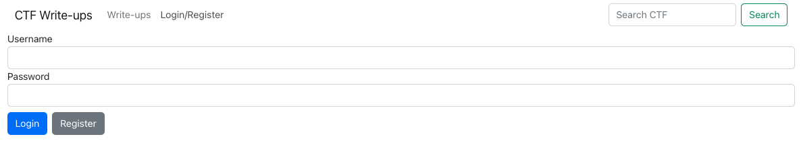
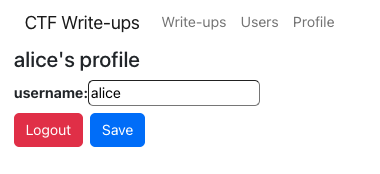
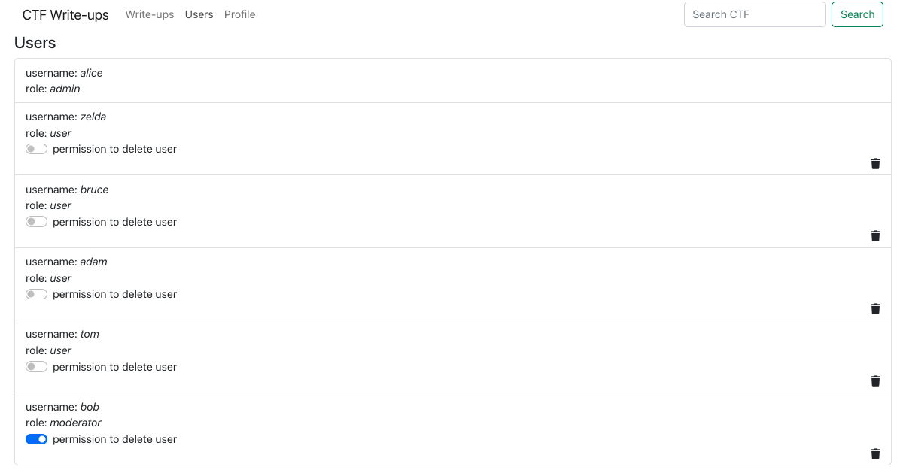
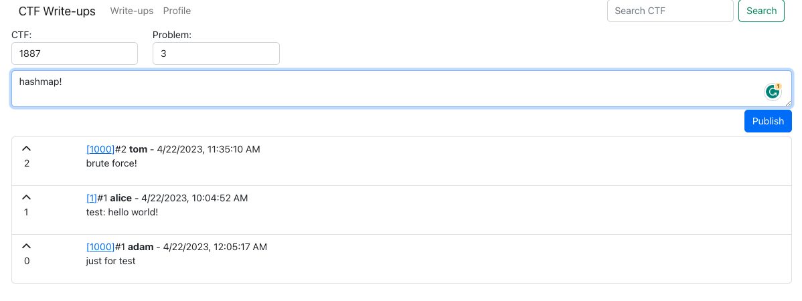
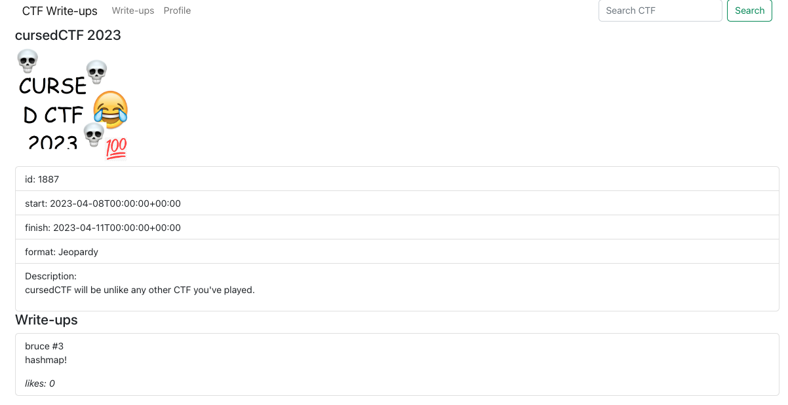
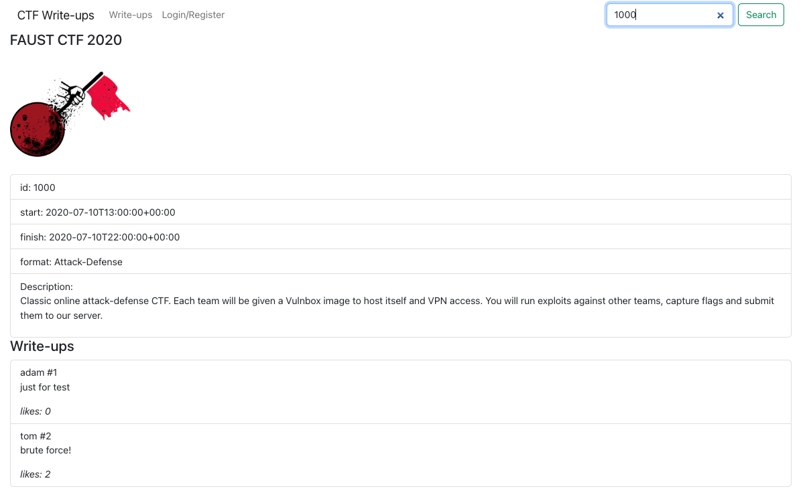

# CTF Write-ups

## Idea behind this

Create a platform where people can share CTF write-ups.

## Backend

[CTF-Writeups-Server](https://github.com/ych3r/CTF-Writeups-Server)

## User Roles

- Moderator: can delete inappropriate write-ups.
- User: can publish and like write-ups.
- Admin: {...User, ...Moderator, can delete user or give user more privilege.}

## Feature

### Home Page

### Login Page

### Profile Page

### Admin Page: Users

### User Page: post write-ups

### Detail page

### Search

## Thanks
- [reverse post list](https://bobbyhadz.com/blog/javascript-map-array-in-reverse-order)
- [like button](https://stackoverflow.com/questions/72153851/create-a-simple-like-button-component-with-react)
